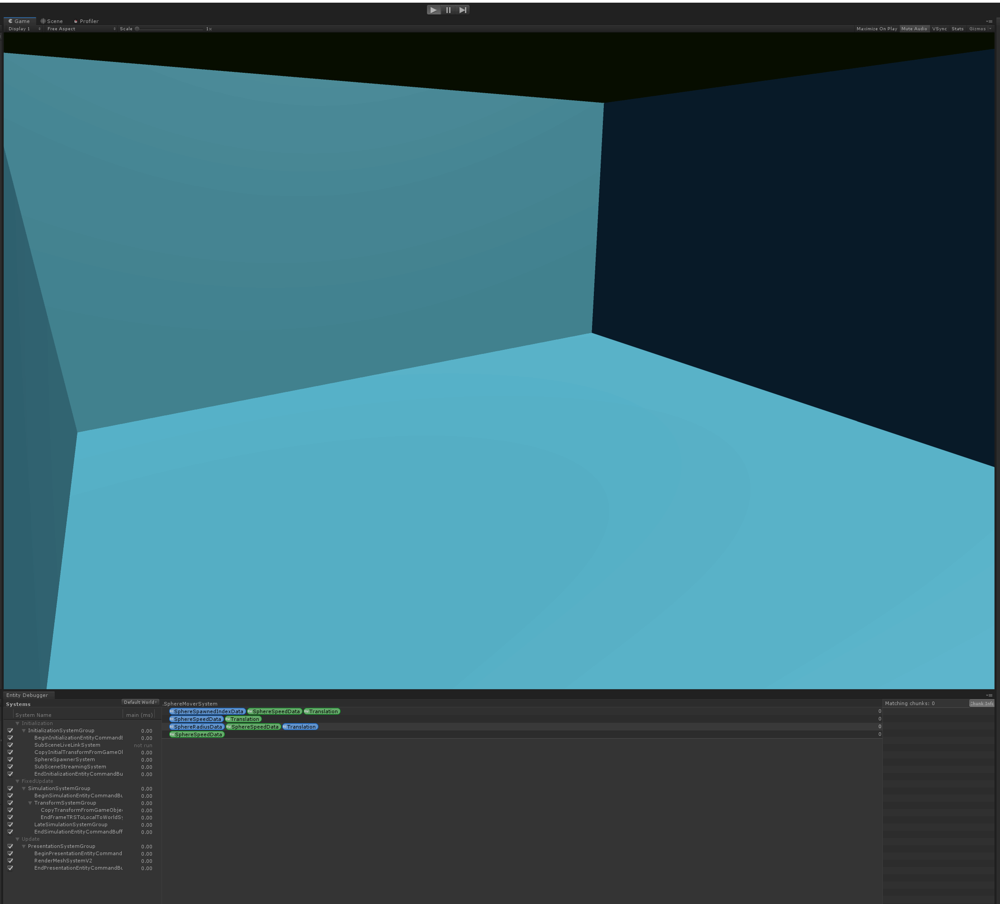

# DOTSpheres

Project made during Consoles&Platforms-Perf Teams' March 2019 "DOTS Hackweek" ( [#consoles-ppt-hackweek](https://unity.slack.com/messages/CGM28CPNH) )

Spheres movements are all made with DOTS!  
(based on the API and samples available in repository https://github.com/Unity-Technologies/dots as of March 2019).

Data controlling the movement of the spheres is defined in files: **SphereSpeedData.cs**, **SphereSpawnedIndexData.cs**, **SphereRadiusData.cs**  
System defined in file **SphereSpawnerSystem.cs** spawns spheres as entities, based on a entity prefab converted from Gameobject prefab **sphere.prefab** at load time.  
Files **SphereSpeedDataProxy.cs**, **SphereSpawnedIndexDataProxy.cs**, **SphereRadiusDataProxy.cs** are the wrappers that are currently required to expose entity data to Gameobject counterparts.

Movement of the spheres in computed by the system and jobs defined in file **SphereMoverSystem**.

